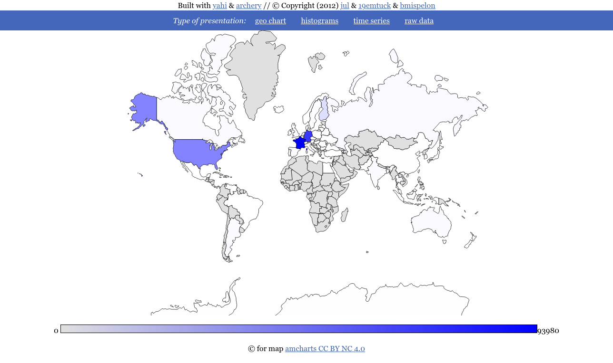

.. _speed_shoot:

===========
speed_shoot
===========

help as usual is obtained this way::

    speed_shoot --help

it spits out:

.. literalinclude:: cli_arg.txt

Usage
*****

Simplest usage is::
    
    speed_shoot -g /usr/local/data/geoIP /var/www/apache/access*log

it will return a json in the form::
    
    {
        "by_date": {
            "2012-5-3": 11
        }, 
        "total_line": 11, 
        "ip_by_url": {
            "/favicon.ico": {
                "192.168.0.254": 2, 
                "192.168.0.35": 2
            }, 
            "/": {
                "74.125.18.162": 1, 
                "192.168.0.254": 1, 
                "192.168.0.35": 5
            }
        }, 
        "by_status": {
            "200": 7, 
            "404": 4
        }, 
        "by_dist": {
            "unknown": 11
        }, 
        "bytes_by_ip": {
            "74.125.18.162": 151, 
            "192.168.0.254": 489, 
            "192.168.0.35": 1093
        }, 
        "by_url": {
            "/favicon.ico": 4, 
            "/": 7
        }, 
        "by_os": {
            "unknown": 11
        }, 
        "week_browser": {
            "3": {
                "unknown": 11
            }
        }, 
        "by_referer": {
            "-": 11
        }, 
        "by_browser": {
            "unknown": 11
        }, 
        "by_ip": {
            "74.125.18.162": 1, 
            "192.168.0.254": 3, 
            "192.168.0.35": 7
        }, 
        "by_agent": {
            "Mozilla/5.0 (X11; Ubuntu; Linux x86_64; rv:12.0) Gecko/20100101 Firefox/12.0,gzip(gfe) (via translate.google.com)": 1, 
            "Mozilla/5.0 (X11; Ubuntu; Linux x86_64; rv:12.0) Gecko/20100101 Firefox/12.0": 10
        }, 
        "by_hour": {
            "9": 3, 
            "10": 4, 
            "11": 1, 
            "12": 3
        }, 
        "by_country": {
            "": 10, 
            "US": 1
        }
    }

If you use::

    speed_shoot -f csv -g /usr/local/data/geoIP /var/www/apache/access*log
    

Your result is::

    by_date,2012-5-3,11
    total_line,11
    ip_by_url,/favicon.ico,192.168.0.254,2
    ip_by_url,/favicon.ico,192.168.0.35,2
    ip_by_url,/,74.125.18.162,1
    ip_by_url,/,192.168.0.254,1
    ip_by_url,/,192.168.0.35,5
    by_status,200,7
    by_status,404,4
    by_dist,unknown,11
    bytes_by_ip,74.125.18.162,151
    bytes_by_ip,192.168.0.254,489
    bytes_by_ip,192.168.0.35,1093
    by_url,/favicon.ico,4
    by_url,/,7
    by_os,unknown,11
    week_browser,3,unknown,11
    by_referer,-,11
    by_browser,unknown,11
    by_ip,74.125.18.162,1
    by_ip,192.168.0.254,3
    by_ip,192.168.0.35,7
    by_agent,"Mozilla/5.0 (X11; Ubuntu; Linux x86_64; rv:12.0) Gecko/20100101 Firefox/12.0,gzip(gfe) (via translate.google.com)",1
    by_agent,Mozilla/5.0 (X11; Ubuntu; Linux x86_64; rv:12.0) Gecko/20100101 Firefox/12.0,10
    by_hour,9,3
    by_hour,10,4
    by_hour,11,1
    by_hour,12,3
    by_country,,10
    by_country,US,1

A commented jumbo command line example
**************************************

The following command line::

    speed_shoot -g data/GeoIP.dat -lf lighttpd \
        -x '{ "datetime" : "^01/May", "uri" : "(.*munin|.*(png|jpg))$"}' \
        -d rejected -d match -i '{ "_country" : "(DE|GB)"  }' \
        *log*  yahi/test/biggersample.log 

does:

- locates  geoIP *g* file in data/GeoIP.dat;
- sets log format *lf* to lighttpd;
- excludes (*x*) any match of either 
    - an uri containing munin or ending by jpg or png
    - May the first;
- includes (*i*) all match containing
    - any IP which has been geoloclaized,
    - any non authentified user;
- will diagnose (*d*) (thus print on stderr) any lines that would not match
  the log format regexp or any lines rejected by *-x* and  *-i*

for all the given log files.

Using a config file
*******************

Well, not impressive:: 

    speed_shoot -c config.json 

If any option is specified in the config file it will override those setted
in the command line.

Here is a sample of a config file:: 

    {
        "exclude" : { 
            "uri"  : ".*munin.*", 
            "referer" : ".*(munin|php).*" 
        },
        "include" : { "datetime" : "^04" },
        "silent" : "False",
        "files" : [ "yahi/test/biggersample.log" ]
    }

Easter eggs or bad idea
***********************

The following options *-x* *-i* *-c* can either take a string or a filename, 
which makes debugging of badly formatted json a pain. 

.. _yahi_all_in_one_maker:

=====================
yahi_all_in_one_maker
=====================

The command ::

    yahi_all_in_one_maker [data.js]

will consume data from :ref:`speed_shoot` to make a « all in one »© HTML page including CSS/JS/vizualization and data.

You just need to share one file, to share your results.

The `results can be seen there <https://jul.github.io/cv/demo.html?route=chrono#hour_hit>`_

Conventions
***********

The generated web page works with the following conventions:

- if a *by_country* key exist it will expect counter in the form of the normalized country code and the counter ;
- else the geo chart will not be shown
- if datas are named begining with *by_* it means you want to vizualize them in a sorted top form (defaults to 40 bins presented)
- if datas have key *date_* *hour_* it means your data are in the form of something lexicographically sortalbe associated with the counter and the JS inside the view will graph them as time series.

The HTML view is litterally built from your data.

===========
Screenshots
===========

These are the screen shots of the « all in one web page » generated by :ref:`yahi_all_in_one_maker`.

* *Geo IP rendering*

* *Top n charts*

.. image:: img/histo.png

* *Date rendering*

.. image:: img/chrono.png

* *Raw data*

.. image:: img/raw.png

