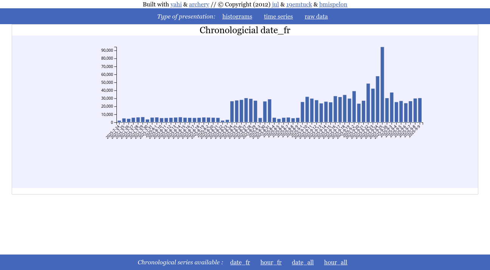
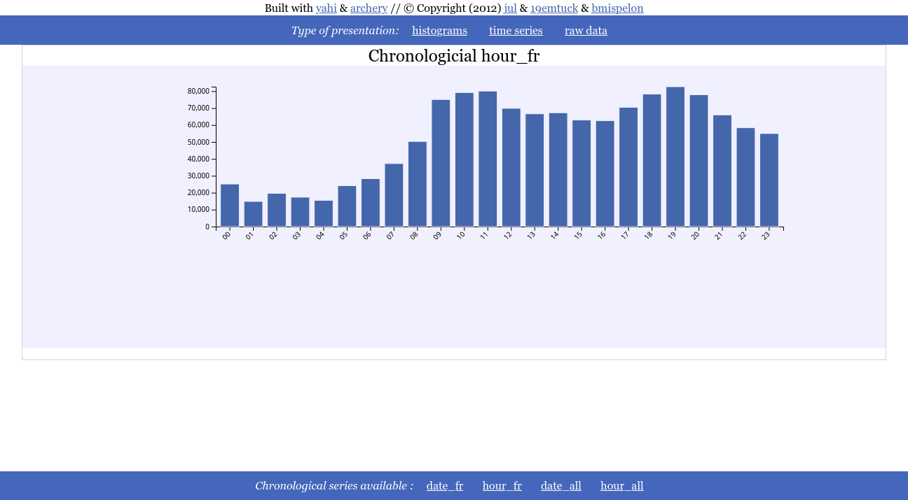
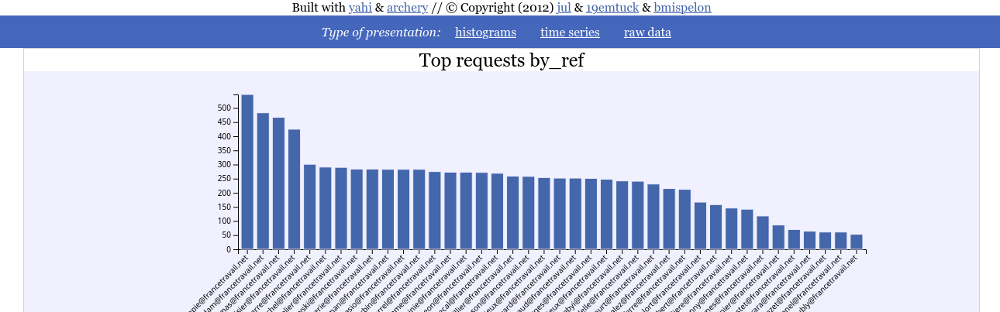
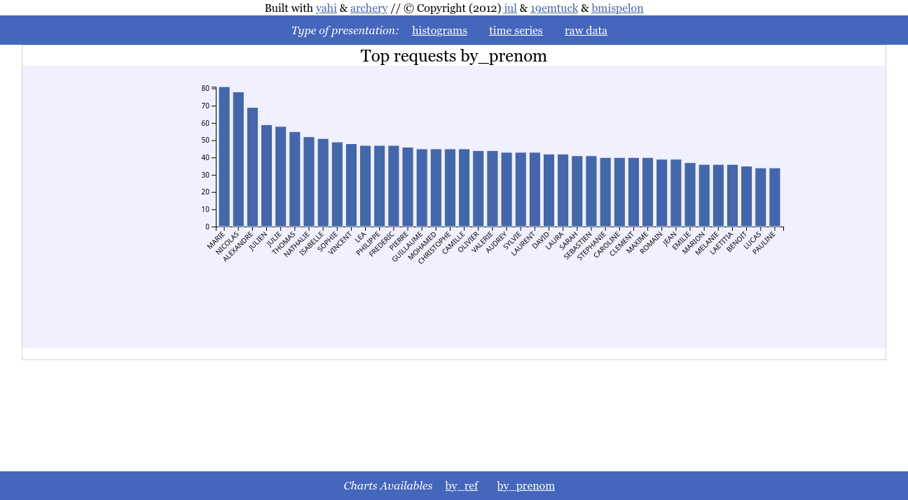
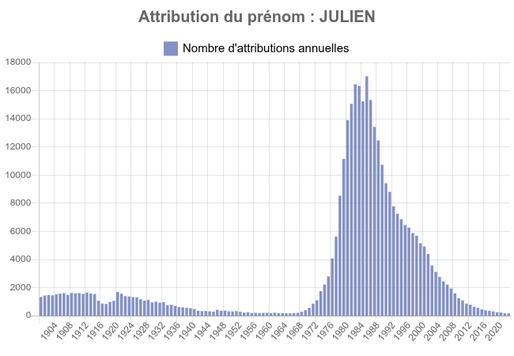
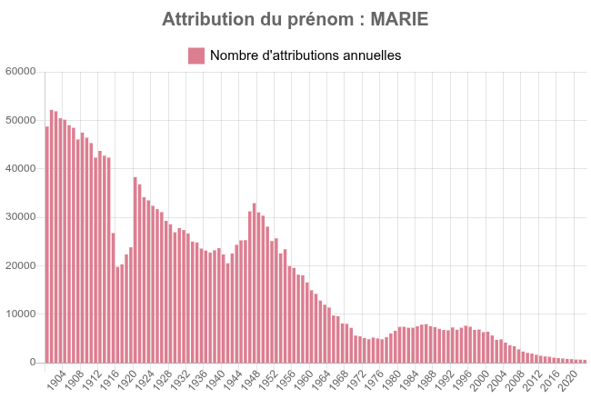
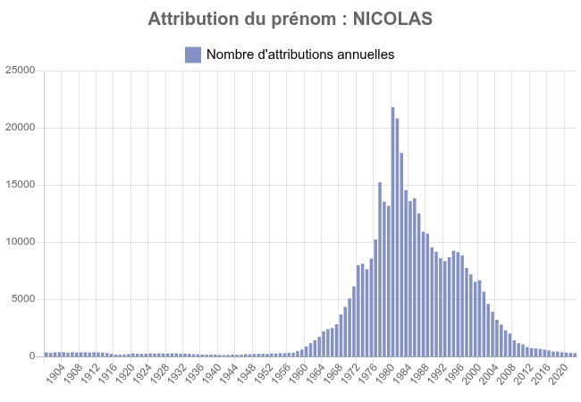

##########################################
Ploting histograms or time series from CSV
##########################################

================================
CSV that can be parsed as regexp
================================

There are simple cases when CSV don't have strings embedded and are litteraly comma separated integers/floats.

In this case, CSV can be parsed as a regexp and it's all the more convenient when the CSV has no title.

Here is an example using the CSV coming from the CSV generated by `trollometre <https://github.com/jul/trollometre/>`_

A line is made off a timestamp followed by various (int) counters.

.. tip:: For the sake of ease of use I hacked the date_pattern format to accept "%s" as a timestamp (while it's normally
    only valid strptime formater)

.. literalinclude:: test.py

Then, all that remains to do is ::

    yahi_all_in_one_maker && firefox aio.html

You click on time series and can see the either the chronological time serie 

Or the profile by hour 

================================
Raw approach with csv.DictReader
================================

Let's take the use case where my job insurance sent me the data of all the 10000 jobless persons
in my vicinity consisting for each line of :

opaque id,civility,firstname, lastname, email,email of the counseler following the job less person

For this CSV, I have the title as the first line, and have strings that may countain ",", hence the regexp approach
is strongly ill advised.

What we want here is 2 histograms :

- the frequency of the firstname (that does not violates RGPD) and that I can share,
- how much each adviser is counseling.

Here is the code 

.. literalinclude:: test2.py

Then, all that remains to do is ::

    yahi_all_in_one_maker && firefox aio.html

And here we can see that each counseler is following on average ~250 jobless persons.

And the frequency of the firstname

Which correlated with the demographic of the firstname as included here below tends to prove
that the older you are the less likeky you are to be jobless.

I am not saying *ageism*, the data are doing it for me.

