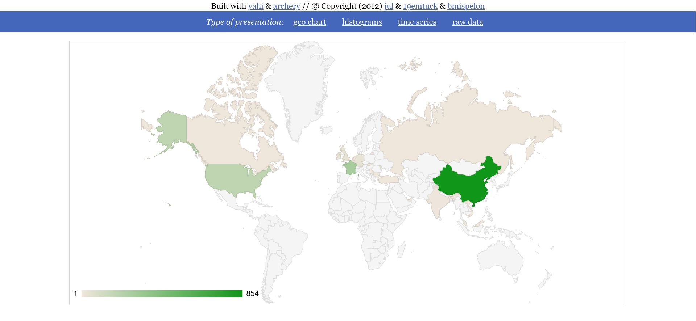
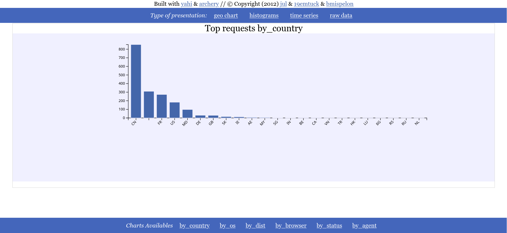
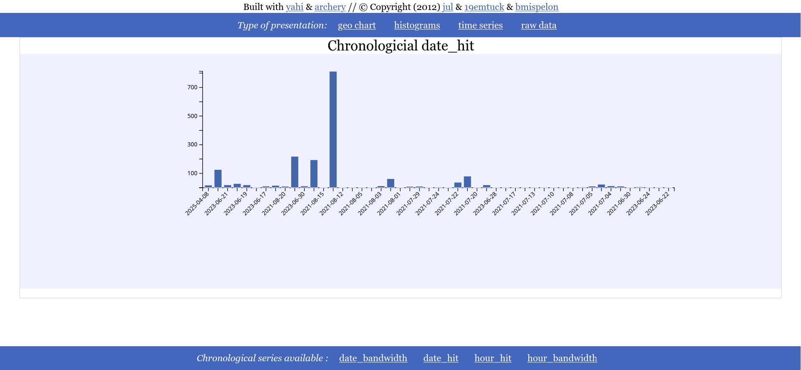
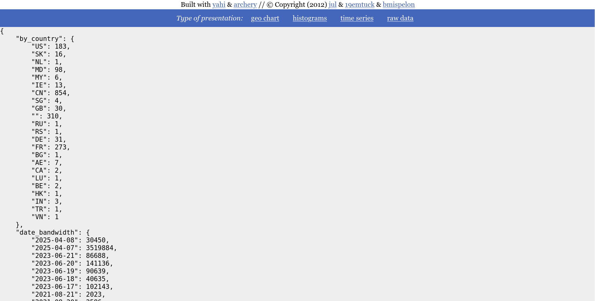

==================
For the intreprids
==================

Requirements:
-------------

A valid legacy geoIP.dat in data/geoIP.dat that can be found on
`mailfud <https://mailfud.org/geoip-legacy/>`_. It is treated later.

doing
-----

The parsing is done with this command::

    python custom_parser.py ../*log* > data.js

then do::

    python make_static.py && firefox aio.html

*make_static.py* being available `here <https://github.com/jul/yahi/blob/master/www/make_static.py>`_.

and enjoy the result : as you have a single app web page (require javascript
activated, sorry w3m users)

A `full functional example is there <https://github.com/jul/yahi/blob/master/www/demo.html>`_

Screenshots
-----------

* *Geo IP rendering*

* *Top n charts*

* *Date rendering*

* *Raw data*

