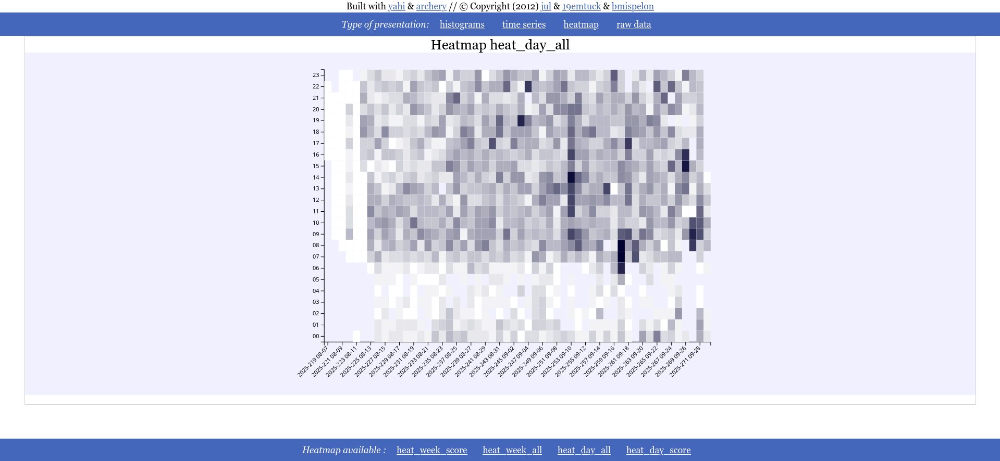
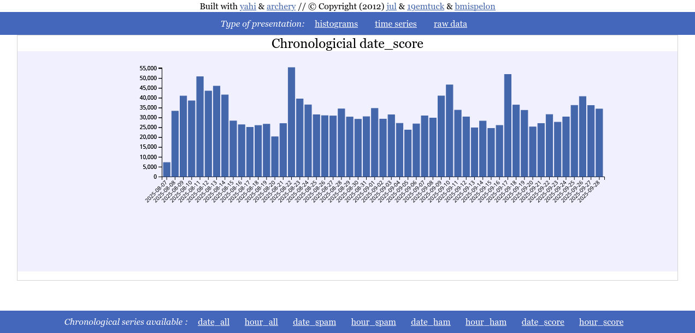

.. _yahi_all_in_one_maker:

=====================
yahi_all_in_one_maker
=====================

The command ::

    yahi_all_in_one_maker [data.js]

will consume data from :ref:`speed_shoot` to make a « all in one »© HTML page including CSS/JS/vizualization and data.

You just need to share one file, to share your results.

The `results can be seen there <https://jul.github.io/cv/demo.html?route=chrono#hour_hit>`_

Conventions
***********

The generated web page works with the following conventions:

- if a *by_country* key exist it will expect counter in the form of the normalized country code and the counter ;
- else the geo chart will not be shown
- if datas are named begining with *by_* it means you want to vizualize them in a sorted top form (defaults to 40 bins presented)
- if datas have key *date_* *hour_* it means your data are in the form of something lexicographically sortalbe associated with the counter and the JS inside the view will graph them as time series.

The HTML view is litterally built from your data.

===========
Screenshots
===========

These are the screen shots of the « all in one web page » generated by :ref:`yahi_all_in_one_maker`.

* *Geo IP rendering*

.. image:: img/geo.png

* *Heatmap*

* *Top n charts*

.. image:: csv_4.png

* *Date rendering*

* *Raw data*

.. image:: img/raw.png

