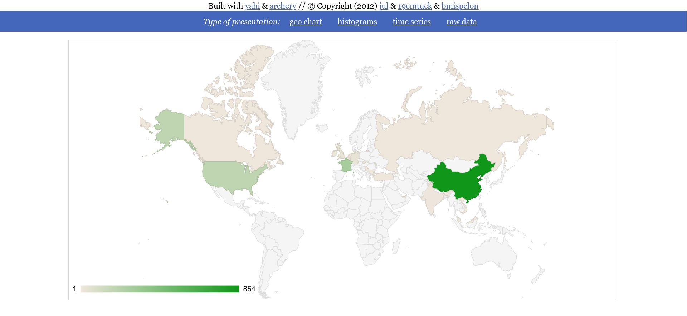
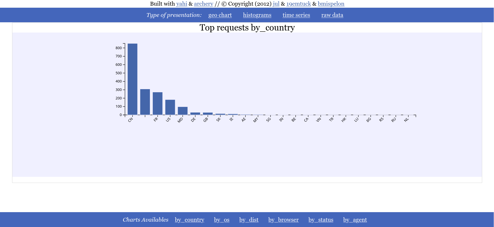
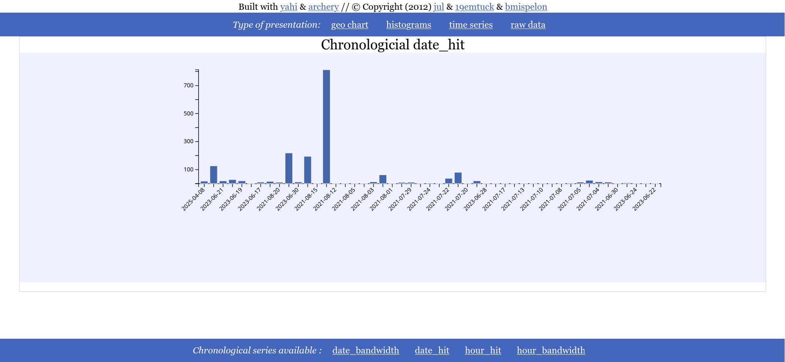
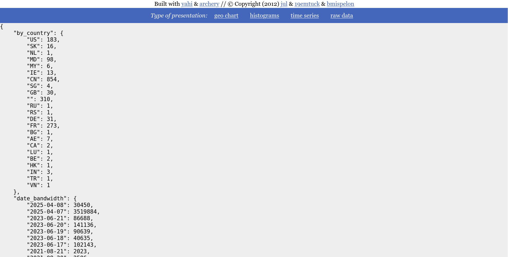

# For the intreprids

## requirements:

A valid legacy geoIP.dat in data/geoIP.dat that can be found on
[mailfud](https://mailfud.org/geoip-legacy/)


## doing
The parsing is done with this command
```
    python custom_parser.py ../*log* > data.js
```
then do

```
    python make_static.py && firefox aio.html
```
and enjoy the result : as you have a single app web page (require javascript
activated, sorry w3m users)

# Screenshots










